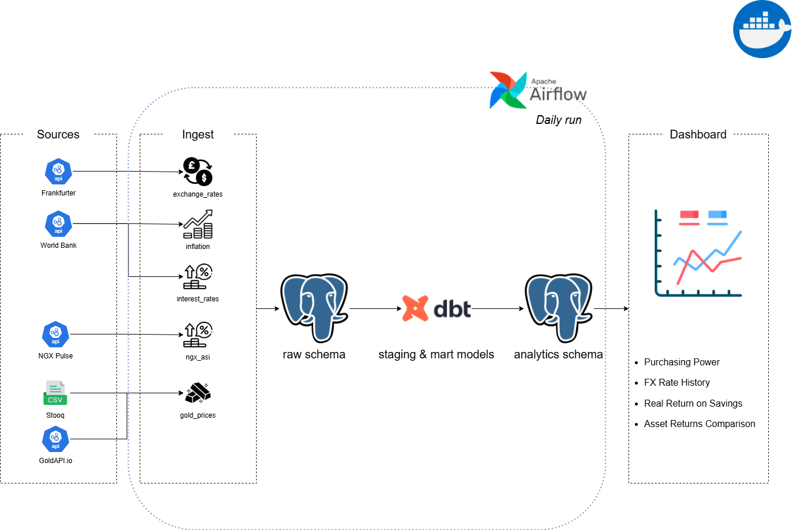

# Nigerian Personal Finance Analytics Pipeline

> A fully automated data pipeline that ingests five streams of Nigerian macro-finance data from public APIs, transforms it with dbt, orchestrates it with Apache Airflow, and answers the question every Nigerian saver faces: *where would my money have actually grown?*

---

## What This Project Does

This pipeline automates the collection of five streams of Nigerian macro-finance data from free public sources, stores and transforms it, and presents it as a dashboard that answers four questions:

1. **Purchasing power:** If you held ₦1,000,000 in cash since January 2020, what is it worth today after inflation?
2. **FX impact:** How has the USD/NGN rate moved? What would ₦1M in dollars be worth today?
3. **Real return on savings:** Do Nigerian bank deposit rates actually beat inflation?
4. **Asset comparison:** Which has performed best - naira cash, USD, gold, or the Nigerian stock market?

---

## Dashboard Preview

> *Screenshots to be added. See Section 5 of the project guide for step-by-step Metabase setup.*

---

## Architecture



---

## Technology Stack

| Layer | Tool | Why |
|---|---|---|
| Language | Python 3.11 | Scripting, API calls, CSV processing |
| Database | PostgreSQL 16 | Reliable open-source OLTP/analytical database |
| Transformation | dbt Core 1.x | SQL-based transformation with testing and docs |
| Orchestration | Apache Airflow 2.x | Industry-standard scheduler, runs via Docker |
| Visualisation | Metabase | Open-source BI, connects directly to PostgreSQL |
| Containerisation | Docker + Docker Compose | Reproducible Airflow and Metabase environments |

---

## Data Sources

| Source | Data | Endpoint / File | Auth |
|---|---|---|---|
| [Frankfurter API](https://api.frankfurter.dev) | USD/NGN, GBP/NGN, EUR/NGN daily FX rates | `GET /v2/{date}` or `GET /v2/{start}..{end}` | None |
| [World Bank API](https://data.worldbank.org) | Annual inflation rate for Nigeria | `FP.CPI.TOTL.ZG` indicator | None |
| [World Bank API](https://data.worldbank.org) | Annual deposit interest rate for Nigeria | `FR.INR.DPST` indicator | None |
| [NGX Pulse API](https://www.ngxpulse.ng) | NGX All-Share Index daily values | `GET /api/ngxdata/indices/asi/history` | `X-API-Key` header |
| [Stooq](https://stooq.com) | Gold price history (XAU/USD) | CSV download — trimmed to 2020+ | None |
| [GoldAPI.io](https://www.goldapi.io) | Gold price daily updates | `GET /XAU/USD/{YYYYMMDD}` | `x-access-token` header |


- **World Bank indicators** (inflation and deposit rate) are published annually, often with lags. Recent years may be missing from `mart_real_savings_return`.

---

## Installation

### Prerequisites

```bash
python --version    # 3.11+
docker --version    # any recent version
psql --version      # any recent version
```

### 1 — Clone and set up Python environment

```bash
git clone https://github.com/chidera-mercy/finance_pipeline.git
cd finance_pipeline

python -m venv venv
source venv/bin/activate # Windows: venv\Scripts\activate
pip install -r requirements.txt
```

### 2 — Configure environment variables

Copy the example env file and fill in your credentials:

```bash
cp .env.example .env
```

Edit `.env`:

```env
DB_HOST=localhost
DB_PORT=5432
DB_NAME=finance_db
DB_USER=finance_user
DB_PASSWORD=your_password

NGX_PULSE_API_KEY=your_ngx_pulse_key
GOLD_API_KEY=your_goldapi_key

AIRFLOW_UID=1000   # use 'id -u' on Linux/Mac, 50000 on Windows
```

**Getting API keys:**
- **NGX Pulse:** Register at https://www.ngxpulse.ng - key arrives by email.
- **GoldAPI.io:** Sign up at https://www.goldapi.io - key is on your dashboard.

### 3 — Set up PostgreSQL

```bash
# Create database and user
psql -U postgres -c "CREATE DATABASE finance_db;"
psql -U postgres -c "CREATE USER finance_user WITH PASSWORD 'your_password';"
psql -U postgres -c "GRANT ALL PRIVILEGES ON DATABASE finance_db TO finance_user;"

# Run DDL script in order
psql -U finance_user -d finance_db -f sql/create_schema.sql
```

### 4 — Seed historical data (one-time backfills)

```bash
# Exchange rates (2020 to today)
python ingest/exchange_rates.py

# Inflation and interest rates (last 20 years)
python ingest/inflation.py
python ingest/interest_rates.py

# NGX All-Share Index (2020 to yesterday)
python ingest/ngx_asi.py

# Gold prices from Stooq CSV (place data/gold_prices_2020_2025.csv first)
python ingest/gold_prices.py
```

### 5 — Run dbt transformations

```bash
cd finance_dbt
dbt debug           # verify connection
dbt run             # build all models
dbt test            # run all data quality tests
```

### 6 — Start Airflow

```bash
cd ..
docker compose up airflow-init   # first time only
docker compose up -d
```

Open http://localhost:8080 (login: `airflow` / `airflow`). Find the `finance_pipeline` DAG, toggle it on, and trigger it manually to verify the full pipeline runs.

### 7 — Start Metabase

```bash
docker run -d -p 3000:3000 --name metabase metabase/metabase
```

Open http://localhost:3000 and connect to your PostgreSQL database. See the project guide for detailed dashboard setup instructions.

---

## Configuration

### dbt Profile (`finance_pipeline/profiles.yml`)

```yaml
finance_dbt:
  target: dev
  outputs:
    dev:
      type: postgres
      host: host.docker.internal
      port: 5432
      user: finance_user
      password: your_password
      dbname: finance_db
      schema: analytics
      threads: 4
```

### Airflow Docker Compose Customisation

The `docker-compose.yaml` is customised from the official Airflow version with:
- `ingest/`, `finance_dbt/`, `data/`, and `profiles.yml` mounted into the containers
- Pipeline environment variables (`DB_*`, `NGX_PULSE_API_KEY`, `GOLD_API_KEY`) passed to containers
- `PYTHONPATH=/opt/airflow` set so `ingest` module imports work inside Airflow tasks
- `DB_HOST=host.docker.internal` used instead of `localhost` so containers can reach PostgreSQL running on the host machine
- `FERNET_KEY` added to `.env` for Airflow to encrypt connection credentials

### Custom Docker Image

A `Dockerfile` in the project root extends the official Airflow image with dbt pre-installed:

```dockerfile
FROM apache/airflow:3.2.2

RUN pip install --no-cache-dir dbt-postgres
```

Build it before starting Airflow:

```powershell
docker compose build
docker compose up -d
```

---

## Usage

### Daily pipeline (automated)

The Airflow DAG `finance_pipeline` runs daily at 6am UTC:
1. Five ingestion tasks run in parallel (exchange rates, inflation, interest rates, NGX ASI, gold prices)
2. `dbt run` executes all staging and mart models
3. `dbt test` validates data quality
4. Metabase dashboard reflects updated data immediately

### Manual incremental run (single day)

```bash
# Run all ingestion scripts for yesterday
python -c "from ingest.exchange_rates import run; run()"
python -c "from ingest.ngx_asi import run; run()"
python -c "from ingest.gold_prices import run; run()"

# Then rebuild dbt models
cd finance_dbt && dbt run
```

### Regenerate dbt docs

```bash
cd finance_dbt
dbt docs generate
dbt docs serve     # opens at http://localhost:8080
```

---

## Project Structure

```
finance_pipeline/
│
├── .env                          
├── .gitignore
├── requirements.txt
├── README.md
├── docker-compose.yaml 
├── Dockerfile 
├── profiles.yml           
│
├── data/
│   └── gold_prices_2020_2026.csv ← trimmed Stooq CSV
│
├── sql/
│   └── create_schema.sql
│   
├── ingest/
│   ├── __init__.py
│   ├── exchange_rates.py         ← Frankfurter API (backfill + daily)
│   ├── inflation.py              ← World Bank API (annual)
│   ├── interest_rates.py         ← World Bank API (annual)
│   ├── ngx_asi.py                ← NGX Pulse API (backfill + daily)
│   └── gold_prices.py            ← Stooq CSV + GoldAPI.io (backfill + daily)
│
├── dags/
│   └── finance_pipeline_dag.py   
│
├── finance_dbt/
│   ├── dbt_project.yml
│   └── models/
│       ├── staging/
│       │   ├── sources.yml
│       │   ├── schema.yml
│       │   ├── stg_exchange_rates.sql
│       │   ├── stg_inflation.sql
│       │   ├── stg_interest_rates.sql
│       │   ├── stg_ngx_asi.sql
│       │   └── stg_gold_prices.sql
│       └── marts/
│           ├── schema.yml
│           ├── mart_purchasing_power.sql
│           ├── mart_fx_history.sql
│           ├── mart_real_savings_return.sql
│           └── mart_returns_comparison.sql
│
└── logs/                        
```

---

## Future Improvements

- [ ] Perform more analysis and draw more insights from the data
- [ ] Track additional currencies (GBP/NGN, EUR/NGN) in the asset comparison chart
- [ ] Add a T-bill / FGN bond yield source to compare with deposit rates
- [ ] Deploy to a cloud PostgreSQL instance so the dashboard is publicly accessible
- [ ] Containerise the entire pipeline (ingest scripts + dbt) alongside Airflow so setup requires only `docker compose up`

---

---

## Author

**Mercy Chidera**
Aspiring Data Engineer | Lagos, Nigeria

- GitHub: [@chidera-mercy](https://github.com/chidera-mercy)
- LinkedIn: [Mercy Chidera Abaraonye](https://linkedin.com/in/chidera-mercy)
- Medium: [Chidera Mercy](https://medium.com/@bychideramercy)

---

*Built with Python · PostgreSQL · dbt Core · Apache Airflow · Metabase*
*Data: Frankfurter API · World Bank API · NGX Pulse API · Stooq · GoldAPI.io*

