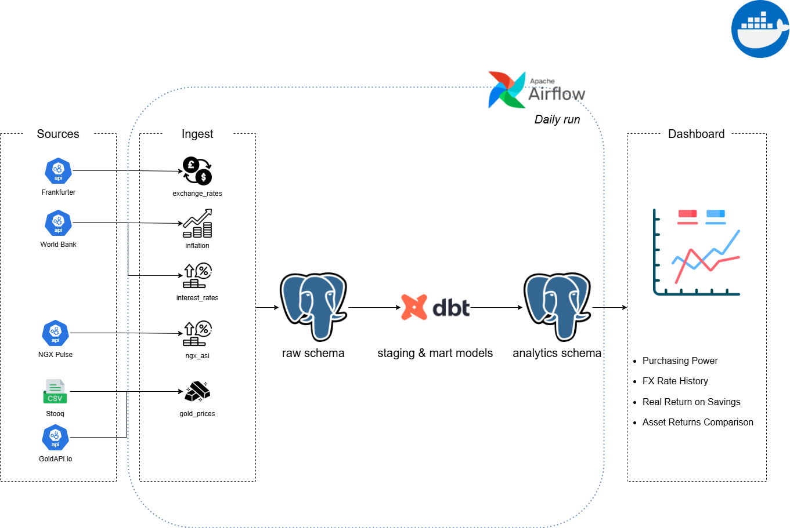
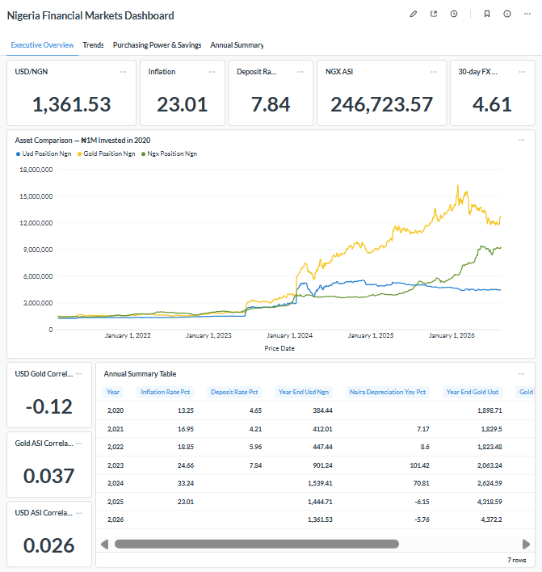
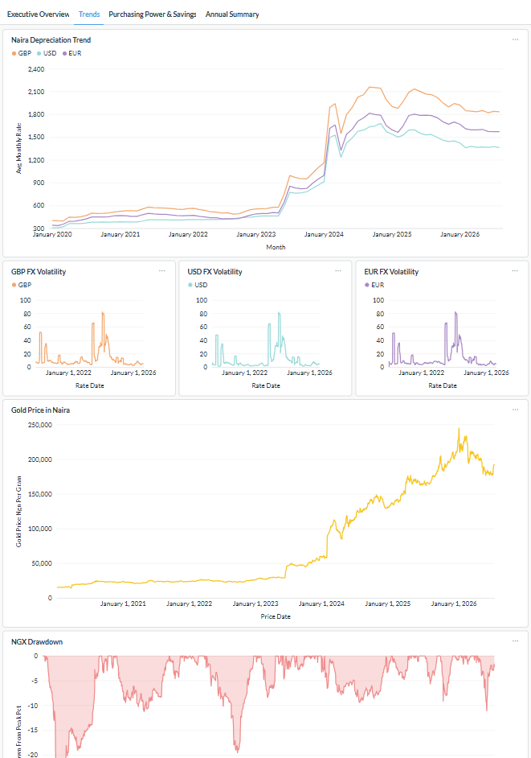
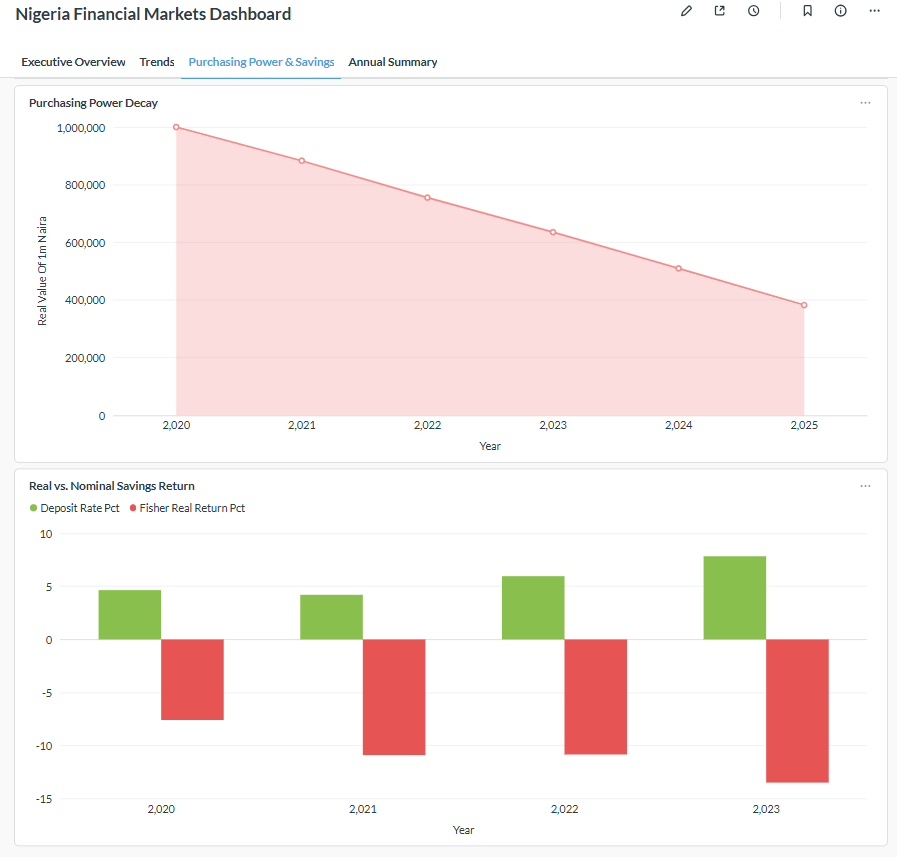
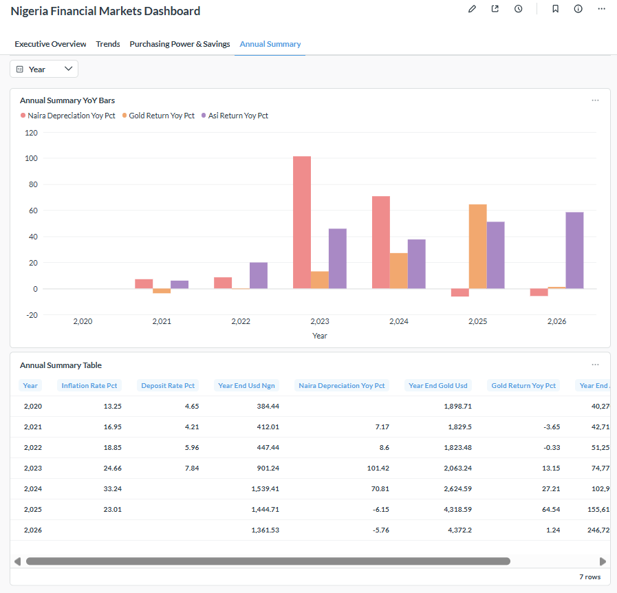
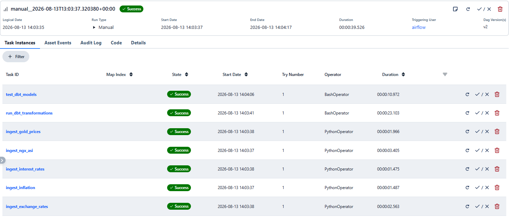
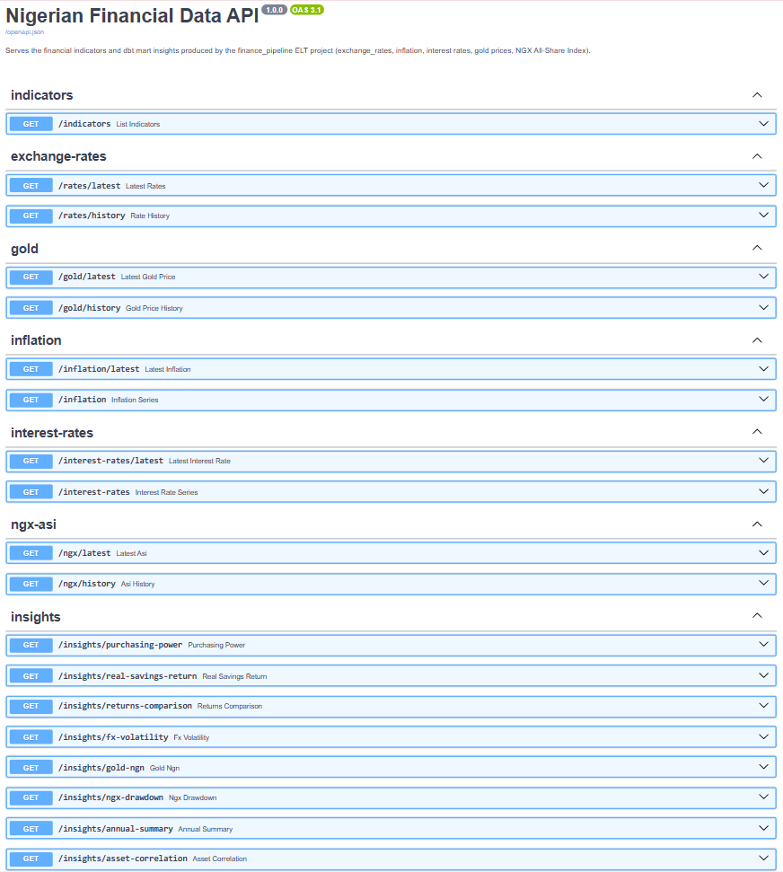
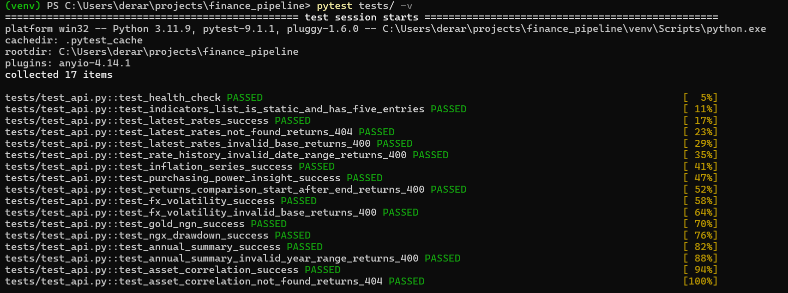

# Nigerian Personal Finance Analytics Pipeline

> A fully automated data pipeline that ingests five streams of Nigerian macro-finance data from public APIs, transforms it with dbt, orchestrates it with Apache Airflow, and answers the question every Nigerian saver faces: *where would my money have actually grown?* Now also served over a REST API built with FastAPI.

---

## What This Project Does

This pipeline automates the collection of five streams of Nigerian macro-finance data from free public sources, stores and transforms it, and presents it as a dashboard that answers four core questions:

1. **Purchasing power:** If you held ₦1,000,000 in cash since January 2020, what is it worth today after inflation?
2. **FX impact:** How has the USD/NGN rate moved? What would ₦1M in dollars be worth today?
3. **Real return on savings:** Do Nigerian bank deposit rates actually beat inflation?
4. **Asset comparison:** Which has performed best - naira cash, USD, gold, or the Nigerian stock market?

Beyond those four, the dbt layer now also surfaces a handful of extra insights the raw data supports: rolling FX volatility, gold priced in naira (not just USD), NGX drawdown from peak, a denormalised year-by-year summary, and the correlation between naira depreciation, gold, and the stock market. All of this — raw data and computed insights alike — is also exposed as a REST API, so the data isn't locked inside the dashboard.

---

## Architecture



---

## Dashboard Preview






---

## Technology Stack

| Layer | Tool | Why |
|---|---|---|
| Language | Python 3.11 | Scripting, API calls, CSV processing |
| Database | PostgreSQL 16 | Reliable open-source OLTP/analytical database |
| Transformation | dbt Core 1.x | SQL-based transformation with testing and docs |
| Orchestration | Apache Airflow 3.x | Industry-standard scheduler, runs via Docker |
| API | FastAPI | Serves raw ingested data and computed dbt insights over REST, independent of the dashboard |
| Visualisation | Metabase | Open-source BI, connects directly to PostgreSQL |
| DB Admin | pgAdmin | Browser-based Postgres viewer, no local client install required |
| Containerisation | Docker + Docker Compose | Reproducible Postgres, Airflow, Metabase, and pgAdmin environments |

### Manual Trigger Airflow DAG Run


### FastAPI docs


### FastAPI pytest


---

## Data Sources

| Source | Data | Endpoint / File | Auth |
|---|---|---|---|
| [Frankfurter API](https://api.frankfurter.dev) | USD/NGN, GBP/NGN, EUR/NGN daily FX rates | `GET /v2/{date}` or `GET /v2/{start}..{end}` | None |
| [World Bank API](https://data.worldbank.org) | Annual inflation rate for Nigeria | `FP.CPI.TOTL.ZG` indicator | None |
| [World Bank API](https://data.worldbank.org) | Annual deposit interest rate for Nigeria | `FR.INR.DPST` indicator | None |
| [NGX Pulse API](https://www.ngxpulse.ng) | NGX All-Share Index daily values | `GET /api/ngxdata/indices/asi/history` | `X-API-Key` header |
| [Stooq](https://stooq.com) | Gold price history (XAU/USD) | CSV download — trimmed to 2020+ | None |
| [GoldAPI.io](https://www.goldapi.io) | Gold price daily updates | `GET /XAU/USD/{YYYYMMDD}` | `x-access-token` header |

---

## Installation

### Prerequisites

```bash
python --version    # 3.11+
docker --version    # any recent version
psql --version      
```

### 1 — Clone and set up Python environment

```bash
git clone https://github.com/chidera-mercy/finance_pipeline.git
cd finance_pipeline

python -m venv venv
source venv/bin/activate # Windows: venv\Scripts\activate
pip install -r requirements.txt
```

### 2 — Configure environment variables

Copy the example env file and fill in your credentials:

```bash
cp .env.example .env
```

Edit `.env`:

```env
DB_HOST=localhost
DB_PORT=5433              
DB_NAME=finance_db
DB_USER=finance_user
DB_PASSWORD=your_password

NGX_PULSE_API_KEY=your_ngx_pulse_key
GOLD_API_KEY=your_goldapi_key

AIRFLOW_UID=1000           # use 'id -u' on Linux/Mac, 50000 on Windows
FERNET_KEY=your_fernet_key # Airflow uses this to encrypt connection credentials
```

**Getting API keys:**
- **NGX Pulse:** Register at https://www.ngxpulse.ng - key arrives by email.
- **GoldAPI.io:** Sign up at https://www.goldapi.io - key is on your dashboard.

### 3 — Start PostgreSQL (Docker)

Postgres runs entirely in Docker — there's no local Postgres install to set up. Start it first, on its own, so you can confirm it's healthy before anything else depends on it:

```bash
docker compose up -d finance-postgres
docker compose ps finance-postgres   # wait for STATUS: healthy
```

The `raw` schema and its 5 tables are created automatically on the container's first startup (`sql/create_schema.sql` is mounted as a Postgres init script). Verify:

```bash
psql -h localhost -p 5433 -U finance_user -d finance_db -c "\dt raw.*"
```
or open pgAdmin at `http://localhost:5050` (see [Configuration](#configuration) for login/connection details) if you'd rather not install `psql` locally.

> If this comes back empty, the init script only runs the very first time the container's volume is created. See the troubleshooting note in [Configuration](#configuration) for how to force it to re-run.

### 4 — Seed historical data (one-time backfills)

```bash
# Exchange rates (2020 to today)
python -m ingest.exchange_rates

# Inflation and interest rates (2020 to current year, fixed window)
python -m ingest.inflation
python -m ingest.interest_rates

# NGX All-Share Index (2020 to yesterday)
python -m ingest.ngx_asi

# Gold prices from Stooq CSV (place data/gold_prices_2020_2026.csv first)
python -m ingest.gold_prices
```

These connect to Postgres via `localhost:5433`, using the `.env` values from step 2.

### 5 — Run dbt transformations

```bash
cd finance_dbt
dbt deps            # installs dbt_utils -- required by some of the mart tests
dbt debug            # verify connection
dbt run              # build all models
dbt test             # run all data quality tests
```

> **Note:** dbt looks for `profiles.yml` in your current working directory first, then falls back to `~/.dbt/profiles.yml`. This project's `profiles.yml` in the repo root is a reference copy — for dbt to actually pick it up without extra flags, either run `dbt` with `--profiles-dir /path/to/finance_pipeline` (or `.` if you copy it into `finance_dbt/`), or just copy it to `~/.dbt/profiles.yml` and edit the values there. `dbt debug` prints which file it's actually using — check that if `dbt run` behaves unexpectedly.

### 6 — Start Airflow and Metabase

```bash
cd ..
docker compose build              # builds the custom Airflow image with dbt pre-installed
docker compose up airflow-init    # first time only
docker compose up -d
```

This brings up Airflow (webserver/scheduler/worker/triggerer)and Metabase alongside `finance-postgres`.

- **Airflow:** `http://localhost:8080` (login: `airflow` / `airflow`). Find the `finance_pipeline` DAG, toggle it on, and trigger it manually to verify the full pipeline runs.
- **Metabase:** `http://localhost:3000`. First run walks you through creating your own admin account (separate from your Postgres credentials). Then **Admin → Databases → Add a database** — host `finance-postgres` (the Docker service name, since Metabase runs on the same Docker network — not `localhost`), port `5432`, plus the database/user/password from `.env`.


### 7 — Start the FastAPI service

Runs locally, outside Docker, connecting via `localhost:5433`:

```bash
uvicorn api.main:app --reload
```

Visit `http://localhost:8000/docs` for interactive Swagger docs covering all endpoints — raw data (exchange rates, gold, inflation, interest rates, NGX ASI) and computed insights (purchasing power, real savings return, returns comparison, FX volatility, gold-in-naira, NGX drawdown, annual summary, asset correlation).

---

## Testing

### dbt data quality tests

```bash
cd finance_dbt
dbt test
```
Runs not-null, uniqueness, accepted-values, and range checks across every staging and mart model.

### FastAPI unit tests

```bash
pytest tests/ -v
```
Runs against a mocked database connection, so this works without Postgres running. Current suite: 17 tests, covering both happy-path responses and error handling (invalid params, empty results).

### Manually verifying the API against real data

Once `finance-postgres` is running and populated:

```bash
curl http://localhost:8000/health
curl http://localhost:8000/rates/latest
curl http://localhost:8000/insights/annual-summary
```
Cross-check any endpoint's output against the database directly, e.g.:
```bash
psql -h localhost -p 5433 -U finance_user -d finance_db -c "SELECT * FROM analytics.mart_annual_summary ORDER BY year;"
```
The `/docs` Swagger page (step 7 above) is the fastest way to try every endpoint interactively, including query parameters, without hand-building `curl` commands.

### Spot-checking ingested row counts

```bash
psql -h localhost -p 5433 -U finance_user -d finance_db -c "
SELECT 'exchange_rates' AS tbl, COUNT(*) FROM raw.exchange_rates
UNION ALL SELECT 'gold_prices', COUNT(*) FROM raw.gold_prices
UNION ALL SELECT 'ngx_asi', COUNT(*) FROM raw.ngx_asi
UNION ALL SELECT 'inflation', COUNT(*) FROM raw.inflation
UNION ALL SELECT 'interest_rates', COUNT(*) FROM raw.interest_rates;
"
```

---

## Configuration

### dbt Profile (`~/.dbt/profiles.yml`, or wherever you point `--profiles-dir`)

```yaml
finance_dbt:
  target: dev
  outputs:
    dev:
      type: postgres
      host: localhost
      port: 5433
      user: finance_user
      pass: your_password
      dbname: finance_db
      schema: analytics
      threads: 4
```

This is the host/port you use *outside* Docker (running `dbt` from your own terminal). Airflow's `BashOperator` tasks run `dbt` from *inside* the `airflow-worker` container instead, where the container's own environment already resolves the database host to `finance-postgres` (the Docker service name) rather than `localhost` — see the Docker Compose customisation below for where that's set.

### Airflow Docker Compose Customisation

The `docker-compose.yaml` is customised from the official Airflow version with:
- `ingest/`, `finance_dbt/`, `data/`, and `profiles.yml` mounted into the containers
- Pipeline environment variables (`DB_*`, `NGX_PULSE_API_KEY`, `GOLD_API_KEY`) passed to containers
- `PYTHONPATH=/opt/airflow` set so `ingest` module imports work inside Airflow tasks
- `DB_HOST=finance-postgres` set inside Airflow's containers so tasks reach the Postgres container by its Docker service name (Docker's internal DNS resolves this on the shared compose network) — this is different from `.env`'s `DB_HOST=localhost`, which is what you use running things from your own terminal outside Docker
- A dedicated `finance-postgres` service (separate from Airflow's own internal metadata Postgres) holds all of this project's actual data, with its schema auto-created via an init script mount — see step 3 of Installation
- `pgadmin` and `metabase` services added, both pointed at `finance-postgres` from inside the Docker network
- `FERNET_KEY` added to `.env` for Airflow to encrypt connection credentials

### Custom Docker Image

A `Dockerfile` in the project root extends the official Airflow image with dbt pre-installed:

```dockerfile
FROM apache/airflow:3.2.2

RUN pip install --no-cache-dir dbt-postgres
```

Build it before starting Airflow:

```powershell
docker compose build
docker compose up -d
```

---

## Usage

### Daily pipeline (automated)

The Airflow DAG `finance_pipeline` runs daily at 6am UTC:
1. Five ingestion tasks run in parallel (exchange rates, inflation, interest rates, NGX ASI, gold prices)
2. `dbt run` executes all staging and mart models
3. `dbt test` validates data quality
4. Metabase and the FastAPI service both reflect the updated data on their next query — no separate refresh step needed, since both read live from Postgres

### Manual incremental run (single day)

```bash
# Run all ingestion scripts for yesterday
python -c "from ingest.exchange_rates import run; run()"
python -c "from ingest.ngx_asi import run; run()"
python -c "from ingest.gold_prices import run; run()"

# Then rebuild dbt models
cd finance_dbt && dbt run
```

### Regenerate dbt docs

```bash
cd finance_dbt
dbt docs generate
dbt docs serve --port 8081     # default port 8080 will clash with Airflow if it's already running
```

---

## Project Structure

```
finance_pipeline/
│
├── .env                          
├── .gitignore
├── requirements.txt
├── README.md
├── docker-compose.yaml 
├── Dockerfile 
├── profiles.yml           
│
├── data/
│   └── gold_prices_2020_2026.csv ← trimmed Stooq CSV
│
├── sql/
│   └── create_schema.sql
│   
├── ingest/
│   ├── __init__.py
│   ├── exchange_rates.py         ← Frankfurter API (backfill + daily)
│   ├── inflation.py              ← World Bank API (fixed 2020-current window)
│   ├── interest_rates.py         ← World Bank API (fixed 2020-current window)
│   ├── ngx_asi.py                ← NGX Pulse API (backfill + daily)
│   └── gold_prices.py            ← Stooq CSV + GoldAPI.io (backfill + daily)
│
├── dags/
│   └── finance_pipeline_dag.py   
│
├── finance_dbt/
│   ├── dbt_project.yml
│   ├── packages.yml               ← dbt_utils dependency
│   └── models/
│       ├── staging/
│       │   ├── sources.yml
│       │   ├── schema.yml
│       │   ├── stg_exchange_rates.sql
│       │   ├── stg_inflation.sql
│       │   ├── stg_interest_rates.sql
│       │   ├── stg_ngx_asi.sql
│       │   └── stg_gold_prices.sql
│       └── marts/
│           ├── schema.yml
│           ├── mart_purchasing_power.sql
│           ├── mart_fx_history.sql
│           ├── mart_real_savings_return.sql
│           ├── mart_returns_comparison.sql
│           ├── mart_fx_volatility.sql
│           ├── mart_gold_ngn.sql
│           ├── mart_ngx_drawdown.sql
│           ├── mart_annual_summary.sql
│           └── mart_asset_correlation.sql
│
├── api/
│   ├── main.py                    ← FastAPI app, router registration
│   ├── database.py                ← connection pooling, RAW_SCHEMA/MART_SCHEMA config
│   ├── schemas.py                 ← Pydantic response models
│   ├── Dockerfile
│   ├── README.md
│   └── routers/
│       ├── indicators.py
│       ├── fx.py
│       ├── gold.py
│       ├── inflation.py
│       ├── interest_rates.py
│       ├── ngx.py
│       └── insights.py
│
├── tests/
│   └── test_api.py                ← pytest suite, mocked DB connection
│
└── logs/                        
```

---

## Author

**Mercy Chidera**
Aspiring Data Engineer | Lagos, Nigeria

- GitHub: [@chidera-mercy](https://github.com/chidera-mercy)
- LinkedIn: [Mercy Chidera Abaraonye](https://linkedin.com/in/chidera-mercy)
- Medium: [Chidera Mercy](https://medium.com/@bychideramercy)

---

*Built with Python · PostgreSQL · dbt Core · Apache Airflow · FastAPI · Metabase*
*Data: Frankfurter API · World Bank API · NGX Pulse API · Stooq · GoldAPI.io*